# SPEC-1-Soulbridge Platform – Post-Launch Test Plan

## Background

Soulbridge (soulbridge.co.za) is a digital memorial platform for creating and sharing online tributes: memorial pages with photos/videos, interactive timelines, tribute wall/guestbook, QR-code sharing, privacy controls, analytics, and paid plans (incl. Paystack payments). A white‑label offering targets funeral homes.

**Assumptions (to be confirmed):**

* Primary launch scope is web (mobile‑responsive) with no native apps.
* Two main go‑to‑market lanes: Direct‑to‑consumer memorial creators and B2B partners (funeral homes) using a white‑label flow.

## Requirements

**Test Objectives (MoSCoW)** — *B2C web-only launch*

**Must Have**

* ✅ Functional coverage of core flows: sign-up/login, profile management, memorial creation wizard, media upload (images/video), timeline entries, tribute/guestbook posting & moderation, QR code creation/scan landing, privacy controls (public/unlisted/password/relations), and memorial sharing (copy link, social share).
* ✅ Payments & plans: create/upgrade/cancel plan; Paystack card & EFT flows; free vs paid feature gating; refunds; webhooks reconciliation; dunning & grace periods.
* ✅ Data protection & security (POPIA-aligned): consent & privacy policy display; data-at-rest encryption (DB, object storage); transport security (HSTS, TLS 1.2+); password policy; rate limiting; basic WAF rules; secrets management; least-privilege roles.
* ✅ Accessibility: WCAG 2.2 AA across top 20 pages/flows; keyboard-only, focus order, color contrast, alt text for memorial media.
* ✅ Performance: p95 TTFB < 500ms (origin), p95 LCP < 2.5s on 4G/low-end mobile, p95 INP < 200ms, p95 upload success under 8s for 5MB images; homepage and memorial page Lighthouse ≥ 85.
* ✅ Browser/device: latest Chrome/Edge/Firefox/Safari; iOS 16+/Android 10+; responsive breakpoints (sm/md/lg/xl); QR scanning on popular mobile browsers.
* ✅ Reliability & DR: error budgets & SLOs (99.9% monthly uptime for public memorial viewing); backups daily (RPO ≤ 24h); restore test (RTO ≤ 4h) for DB and media.
* ✅ Observability: structured logging, error tracking (frontend+backend), uptime & synthetic checks for create/view memorial; dashboard with key KPIs.
* ✅ Email/SMS: transactional emails (verify email, reset password, payment receipts, share links); DKIM/SPF/DMARC pass; bounced/blocked handling.
* ✅ SEO/Indexing: canonical tags, robots directives, sitemaps; open graph & structured data for memorial pages; 404/410 behavior for removed pages; QR landing indexed as intended.

**Should Have**

* 🔷 Content safety & moderation: profanity & image nudity checks (thresholds), user report flow, admin review queue; rate-limit abusive posting.
* 🔷 Analytics accuracy: page views, QR scans, memorial creation funnel (wizard step drop-off), campaign UTM capture; cross-validate client vs server events; cookie consent gating.
* 🔷 Internationalization readiness: currency/locale formatting; date/timezones on timelines.
* 🔷 Export & portability: memorial export (PDF/ZIP) and account deletion flow validated end-to-end.

**Could Have**

* 🟩 Load test at 10× expected peak (e.g., 200 RPS view, 20 RPS write); chaos experiments for storage unavailability; blue/green or canary smoke tests.
* 🟩 White-label hooks behind feature flags (hidden at B2C launch) regression tests.

**Won't Have (this launch)**

* ⛔ Native apps testing (iOS/Android), in-app purchases.
* ⛔ B2B white-label partner portal, SSO/SAML.

**Confirmed**

* Public memorials are indexable by default; private/unlisted are non-indexable.
* Paid plans use auto-renew with a 7-day grace period before downgrade.

## Method

### A. Test Suite & Coverage Matrix (tools in parentheses)

* **E2E user journeys (Playwright):** sign-up, memorial creation, media upload, timeline add/edit, tribute post/moderate, privacy toggle, share/QR open, upgrade/downgrade/cancel plan, refund.
* **API & contract tests (Playwright API / Pact optional):** public memorial view, tribute CRUD with auth, rate limits, idempotency.
* **Payments & Billing (Paystack sandbox + webhook replay):** plan creation, subscription start/renew/failed payment/dunning/cancel/refund; verify webhook signatures and state reconciliation.
* **Accessibility (axe-core + manual WCAG 2.2 AA):** automated checks in CI + manual screen reader passes (NVDA/VoiceOver), keyboard-only flows.
* **Performance (Lighthouse CI + PSI + synthetic):** LCP, INP, CLS budgets; TTFB origin; upload throughput; cache-hit ratios.
* **Security (OWASP ASVS 5.0 mapping + ZAP baseline/active with approvals):** auth/session, access control, input validation, secrets, headers, TLS, logging; dependency & container scans.
* **SEO (Search Console, structured data tests):** sitemap fetch, robots, canonical, og:*, JSON-LD; noindex for private/unlisted.
* **Reliability/DR (backup & restore drills):** DB and object storage restore into a clean env; measure RTO/RPO; broken-link crawl after restore.
* **Observability (synthetics + alerts):** uptime checks for /, /memorial/:id, create wizard; error budget burn alerts.

### B. Golden Paths (E2E) – minimum set

1. **Create Memorial (guest → account):** visit home → start memorial → create account → complete wizard (name, dates, bio) → upload 3 images + 1 video → add 2 timeline items → set privacy "public" → publish → share link → open link in incognito (assert indexable).
2. **Post Tribute (visitor):** open public memorial → post tribute → verify moderation rules → owner approves → visible.
3. **QR Flow (owner & guest):** generate QR → scan on iOS & Android → land on memorial → open in-app browser & Safari/Chrome.
4. **Upgrade Plan:** from free to paid → Paystack card success → webhook received → feature gates unlock.
5. **Dunning → Grace → Downgrade:** fail renewal → dunning emails → within 7-day grace, features continue → after grace, downgrade and memorial remains viewable.

### C. Non‑Functional Tests

* **Performance Budgets (mobile, 4G):** p95 LCP ≤ 2.5s, p95 INP ≤ 200ms, CLS ≤ 0.1; p95 TTFB origin ≤ 500ms; payload ≤ 200KB critical path.
* **Load & Soak:** view 200 RPS (95th < 200ms CDN, < 800ms origin); write 20 RPS; 2‑hr soak test.
* **Accessibility:** pass axe suite; manual: focus order, traps, alt text, captions, color contrast ≥ 4.5:1, form errors announced.

### D. Security Verification (ASVS 5.0 subset)

* **V2 Auth:** MFA optional, strong password policy, proper session timeouts; OAuth social login (if present) conforms.
* **V4 Access Control:** memorial visibility enforced server-side; owner vs visitor permissions; forced browsing blocked.
* **V5 Validation/Sanitization:** tributes & bios HTML sanitized; file upload MIME/extension/AV scans; size limits.
* **V7 Crypto:** TLS 1.2+; HSTS; encryption at rest; key rotation SOP.
* **V9 Data Protection/Privacy:** POPIA notices, consent records, purpose limitation; PII export/delete tested.
* **V13 API:** rate limits, idempotency keys on POST/PUT; error messages free of sensitive data.

### E. SEO/Indexing Rules

* **Public memorials:** `index,follow`; canonical self, JSON‑LD Person/Memorial schema, OG/Twitter cards.
* **Unlisted/private:** `noindex,nofollow` via meta and header; gated content requires auth; ensure URLs return 401/403 to crawlers.
* **Removed memorials:** 410 with tombstone page and cache purge.

### F. Tooling & Pipelines (CI/CD)

* **CI gates:** unit → API → E2E (Playwright) → a11y (axe) → ZAP baseline → Lighthouse CI.
* **Pre‑prod smoke:** deploy → run golden paths + payments sandbox → SEO & sitemap fetch → backup/restore drill (weekly).
* **Prod synthetics:** 1‑min uptime pings; hourly scripted journeys; alert routes & on‑call.

### G. Test Data & Environments

* **Synthetic personas:** Owner (paid/free), Moderator, Visitor.
* **Media fixtures:** 5MB/10MB images; 30s MP4; corrupted files for negative tests.
* **Payments:** Paystack test keys; webhook secret rotation tests; replay fixtures for renewal/dunning/cancel/refund.

### H. Diagrams (PlantUML)

```plantuml
@startuml
skinparam shadowing false
package "CI Pipeline" {
  [Unit Tests] --> [API Tests]
  [API Tests] --> [E2E (Playwright)]
  [E2E (Playwright)] --> [Accessibility (axe)]
  [Accessibility (axe)] --> [ZAP Baseline]
  [ZAP Baseline] --> [Lighthouse CI]
  [Lighthouse CI] --> [Deploy to Staging]
}
[Deploy to Staging] --> [Pre‑prod Smoke Suite]
[Pre‑prod Smoke Suite] --> [Manual Sign‑off]
[Manual Sign‑off] --> [Deploy to Prod]
[Deploy to Prod] --> [Prod Synthetics]
@enduml
```

## Implementation Status

### Current Platform Status

**✅ Implemented Features:**

1. **Authentication & Authorization**
   - Clerk authentication (production instance)
   - Google OAuth integration
   - Email/password authentication
   - Protected routes via middleware

2. **Memorial Management**
   - Memorial creation wizard
   - Media upload (photos, videos, audio)
   - Biography and obituary sections
   - Timeline events
   - Family tree feature
   - Memorial services scheduling
   - Slug-based URLs (e.g., /firstname-lastname-year)

3. **Interactive Features**
   - Tribute wall
   - Virtual candle lighting
   - Guestbook
   - Location tracking

4. **Privacy & Visibility**
   - Public/private memorial settings
   - Visibility controls

5. **Social Sharing**
   - Open Graph images (pre-generated)
   - Social share buttons (WhatsApp, Facebook, X, Email)
   - Download square OG images for Instagram/TikTok
   - QR code generation

6. **Subscription Plans**
   - Lite (free) plan: 1 memorial
   - Essential plan (R99/month): 3 memorials
   - Premium plan (R199/month): 10 memorials
   - Paystack payment integration
   - Plan management (upgrade/downgrade)

7. **Order of Service**
   - PDF generation with Print option (primary)
   - Quick Download option (secondary/experimental)
   - Profile picture and obituary display

8. **Analytics & Tracking**
   - Memorial view counts
   - Share tracking
   - Basic engagement metrics

**⏳ Pending Test Coverage:**

1. **E2E Tests (Playwright)**
   - Setup required
   - Golden path test suite needed

2. **Accessibility Testing**
   - axe-core integration needed
   - Manual WCAG 2.2 AA audit required
   - Screen reader testing

3. **Performance Testing**
   - Lighthouse CI integration needed
   - Load testing setup
   - Performance budget enforcement

4. **Security Testing**
   - OWASP ZAP baseline scans
   - Dependency scanning
   - ASVS 5.0 compliance audit

5. **Payment Testing**
   - Paystack sandbox test suite
   - Webhook replay tests
   - Dunning flow validation

6. **Disaster Recovery**
   - Backup/restore procedures documented
   - RTO/RPO testing required
   - Failover procedures

### Next Steps

**Phase 1: Critical Testing Setup (Week 1-2)**

1. Set up Playwright E2E testing framework
2. Implement golden path tests (5 core flows)
3. Set up Lighthouse CI with performance budgets
4. Configure axe-core accessibility tests

**Phase 2: Security & Compliance (Week 3-4)**

1. Run OWASP ZAP baseline scans
2. Implement dependency scanning (Dependabot/Snyk)
3. POPIA compliance audit
4. Security headers verification

**Phase 3: Payment & Plan Testing (Week 4-5)**

1. Paystack sandbox test suite
2. Webhook integration tests
3. Subscription lifecycle tests
4. Dunning and grace period validation

**Phase 4: Production Monitoring (Week 5-6)**

1. Set up synthetic monitoring
2. Configure alerting and on-call
3. Error tracking refinement (Sentry/similar)
4. Performance monitoring dashboard

**Phase 5: Disaster Recovery (Week 6-7)**

1. Document backup procedures
2. Test restore procedures
3. Measure RTO/RPO
4. Create runbooks

### Test Environment URLs

* **Production:** https://soulbridge.co.za
* **Staging/Preview:** Vercel preview deployments (per PR)
* **Database:** Supabase (production instance)
* **Storage:** Supabase Storage (memorial-media bucket)
* **Payments:** Paystack (production keys, sandbox for testing)

### Contact & Resources

* **Repository:** https://github.com/langaludidi/soulbridge
* **Vercel Project:** soulbridge (team: ludidil-5352s-projects)
* **Database:** Supabase (dgozbsamgmgmkygsunnt)
* **Auth:** Clerk (production instance: clerk.soulbridge.co.za)
* **Payments:** Paystack (production integration)

---

**Document Status:** Created 2025-10-27
**Last Updated:** 2025-10-27
**Version:** 1.0
**Owner:** SoulBridge Platform Team
